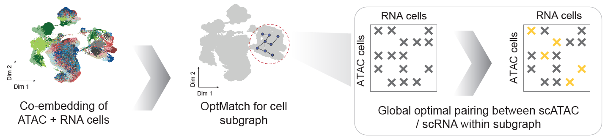
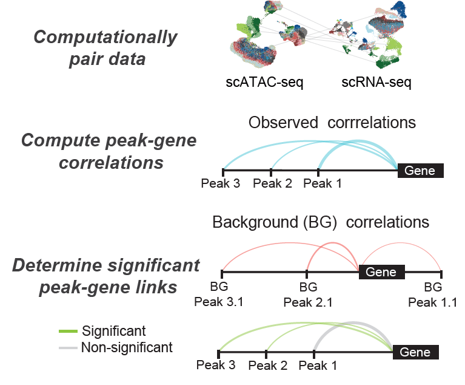

# Functional Inference of Gene Regulation (FigR)

Core code associated with manuscript (coming soon!) detailing scATAC and scRNA-seq integration worflow

FigR is a computational framework for supporting the integration of single cell chromatin accessibility and gene expression data to infer transcriptional regulators of target genes

FigR uses independently or concomitantly-profiled single-cell ATAC-seq (scATAC-seq) and scRNA-seq, to 
i) computationally-pair scATAC-seq and scRNA-seq datasets (if needed), ii) infers cis-regulatory interactions, and iii) defines a TF-gene gene regulatory network (GRN)

1. OptMatch pairing of scATAC and scRNA-seq cells

Optimal ATAC-RNA cell matching to accurately pair imbalanced, independently generated scATAC and scRNA-seq datasets for downstream integration and analyses 

2. Determining domains of regulatory chromatin (DORCs) using paired scATAC-seq scRNA-seq information

*Cis*-regulatory correlation analysis framework to identify gene-peak (chromatin accessibility peak) significant associations and deduce key genes that are domains of such regulatory activity (DORCs)

3. Using FigR to determine transcriptional activators and repressors of target genes

Core component for functional inference of gene regulation using DORCs and TF motifs, to identify putative TF activators and regulators of gene activity

